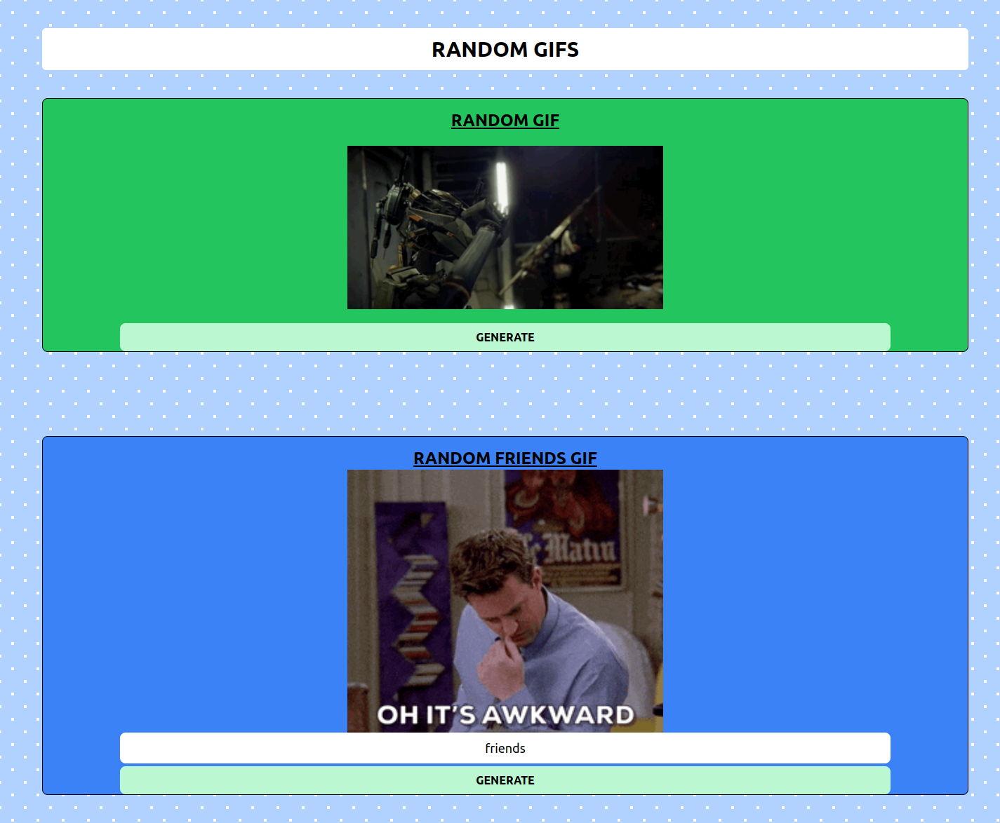

# Random-gifs
- Tech Stack - ReactJS, TailwindCSS
- Fetching random and tag based gifs from api
- Concepts:
    - Axios - a promise-based HTTP library that lets developers make  requests to either their own or a third-party     server to fetch data
    - Custom Hooks - created useGif to fetch gif from api

# Snapshot
